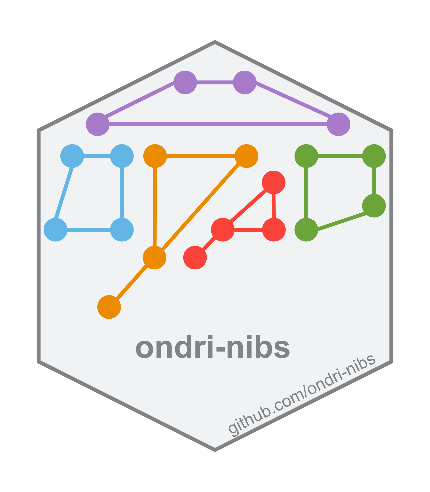
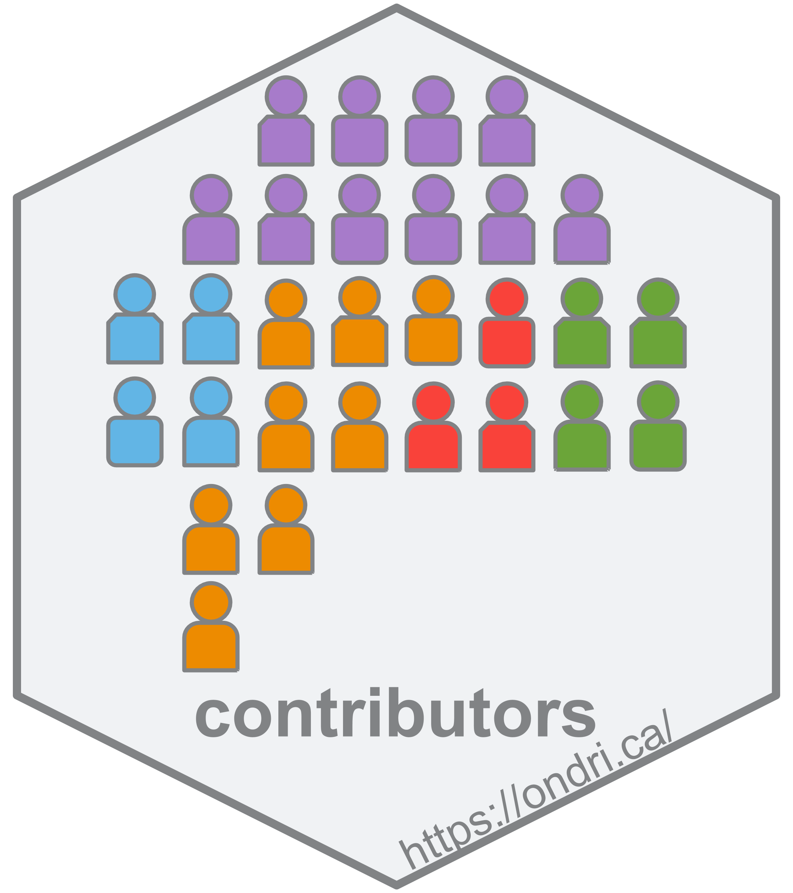

```{r setup, include=FALSE}
knitr::opts_chunk$set(echo = TRUE)
```

# ondri-nibs 

The `ondri-nibs` page is an organization page for the Ontario Neurodegenerative Disease Research Initiative's (ONDRI) Neuroinformatics & Biostatistics (NIBS) team to house materials for public (and internal) consumption.

Generally, this organization page has multiple repositories, each repository contains a unique item (e.g., Shiny apps, packages) or conceptual content (e.g., documentation). This page will provide links to each of those as the project grows and changes.


# contributors 

This [repository](https://github.com/ondri-nibs/contributors) is a single file to keep track of all contributors to the NIBS material provided here. 

<br><br>

# ondridocs 

This [repository](https://github.com/ondri-nibs/documentation) is a home for all the external facing (and some internally useful) documentation.


<br><br>

# toy data 

This [repository](https://github.com/ondri-nibs/toy_data) provides two "toy" data sets. These data sets help illustrate a few things:

* Each one shows how a tabular and non-tabular data set would be constructed

* The data are synthetic, and also provide an illustrative data set for use with all of the apps and methods here (e.g., standards, data preparation, outlier detection)


# ondricolors 

This [repository](https://github.com/ondri-nibs/ondricolors) houses a lightweight `R` package designed with one purpose: to provide a color palette package with the official ONDRI colors.


# ondricolors 

This [repository](https://github.com/ondri-nibs/ondridown) houses a lightweight package to provide an `RMarkdown` template so that we can have harmonized looking documents.


# standards_app 


Coming soon! A repository for the integrated ONDRI standards (Shiny) app. 


