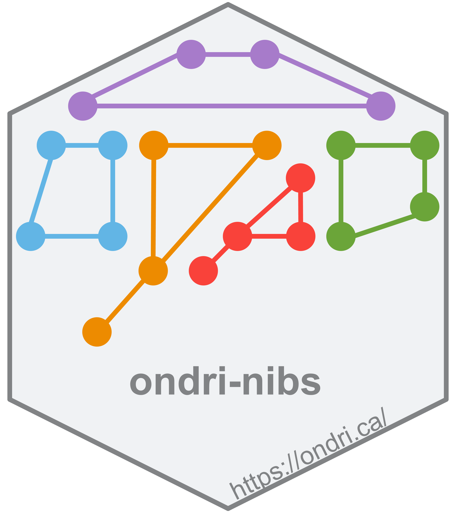
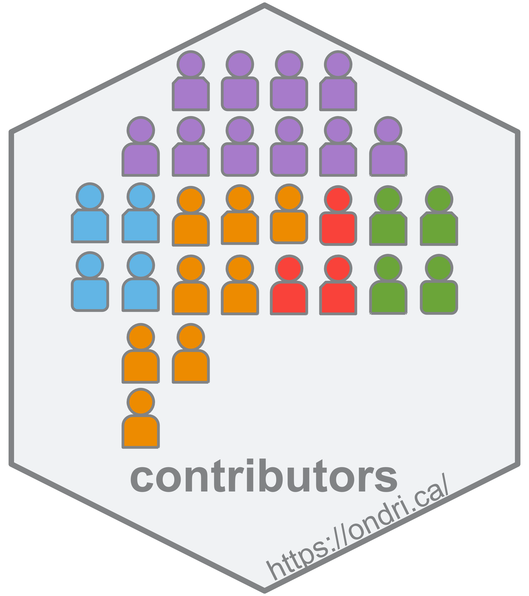
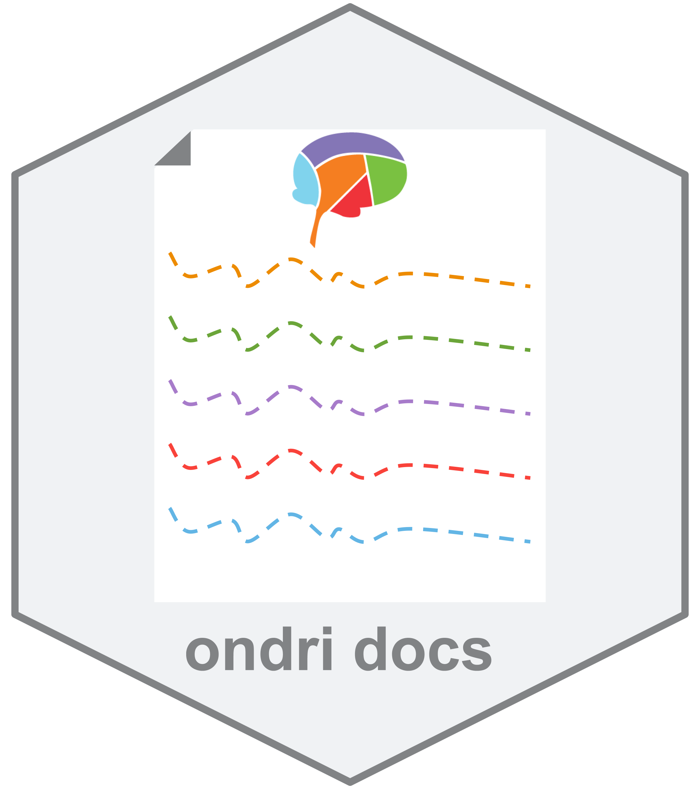
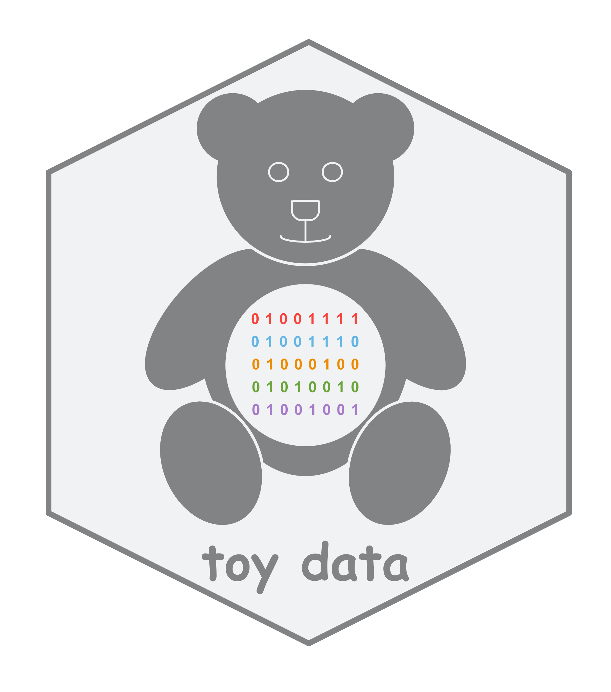
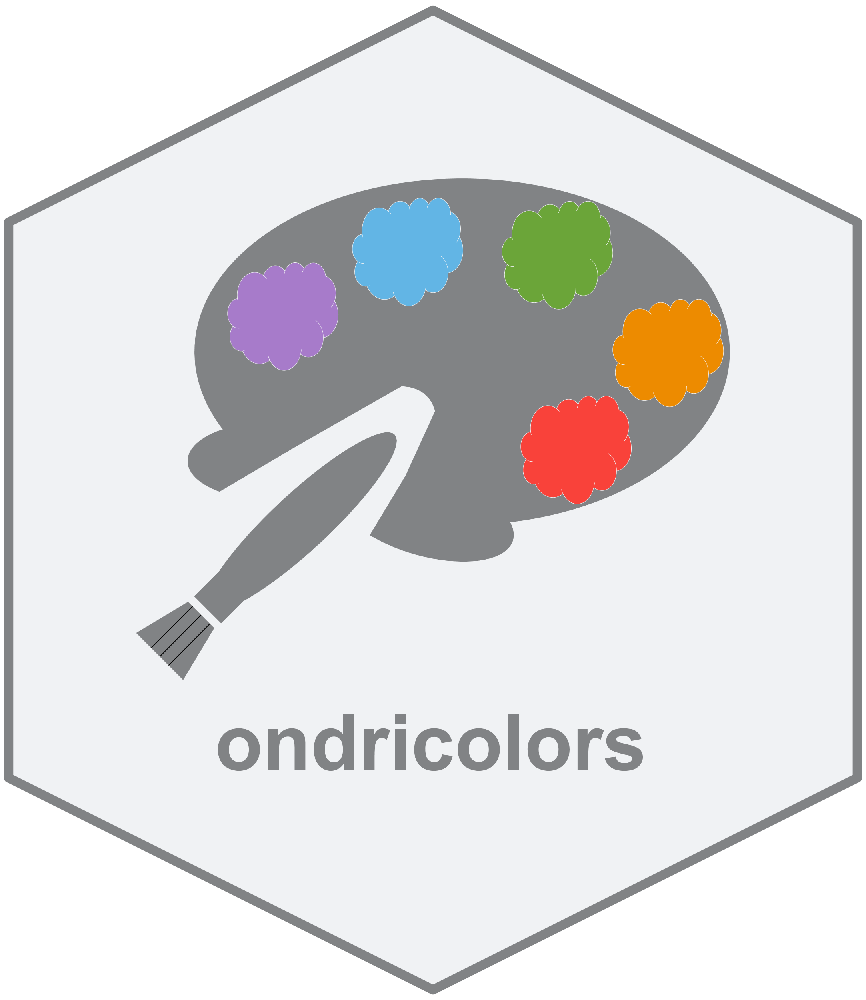
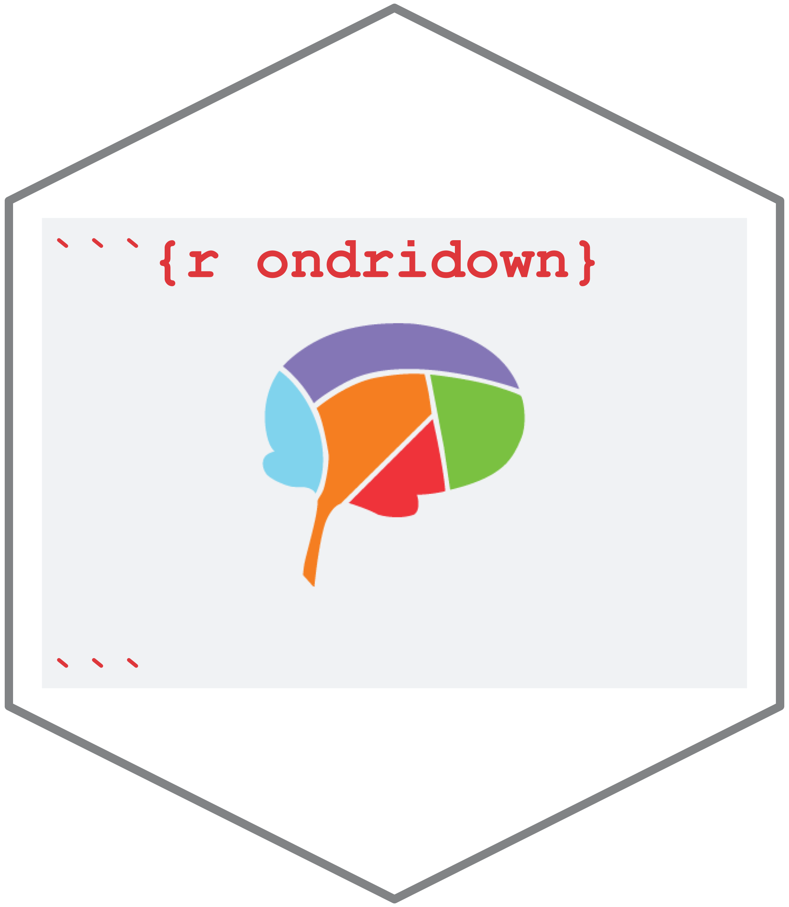
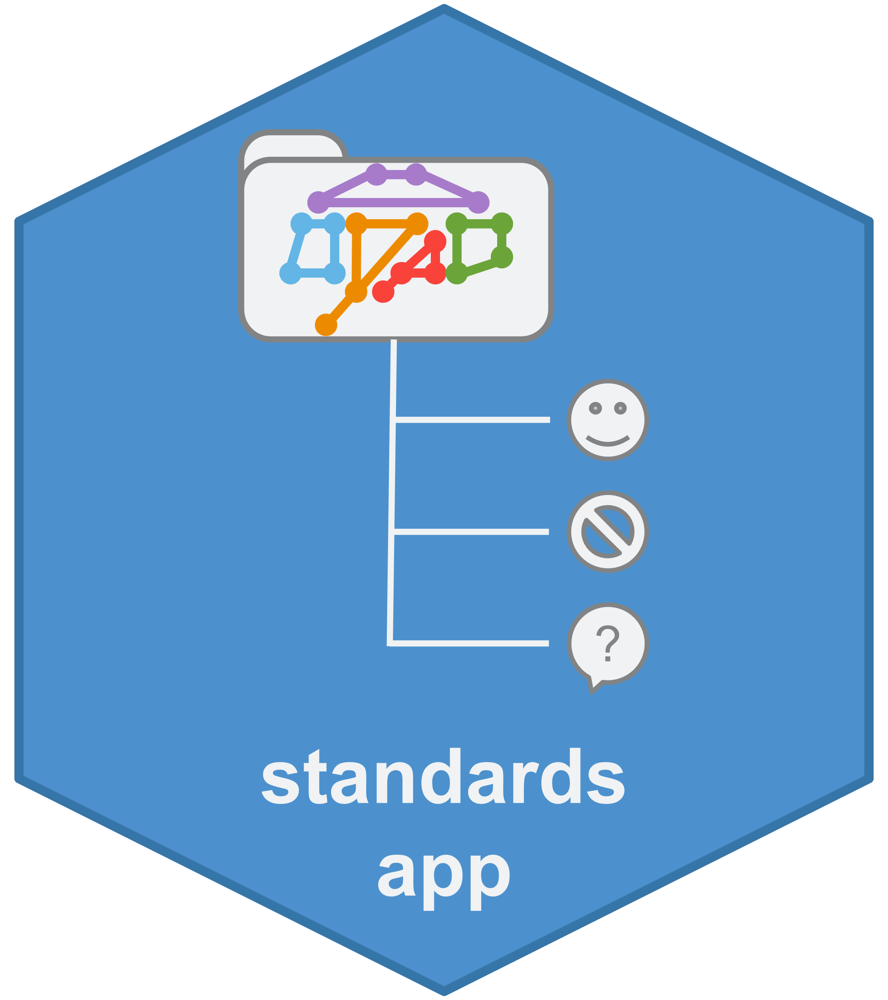
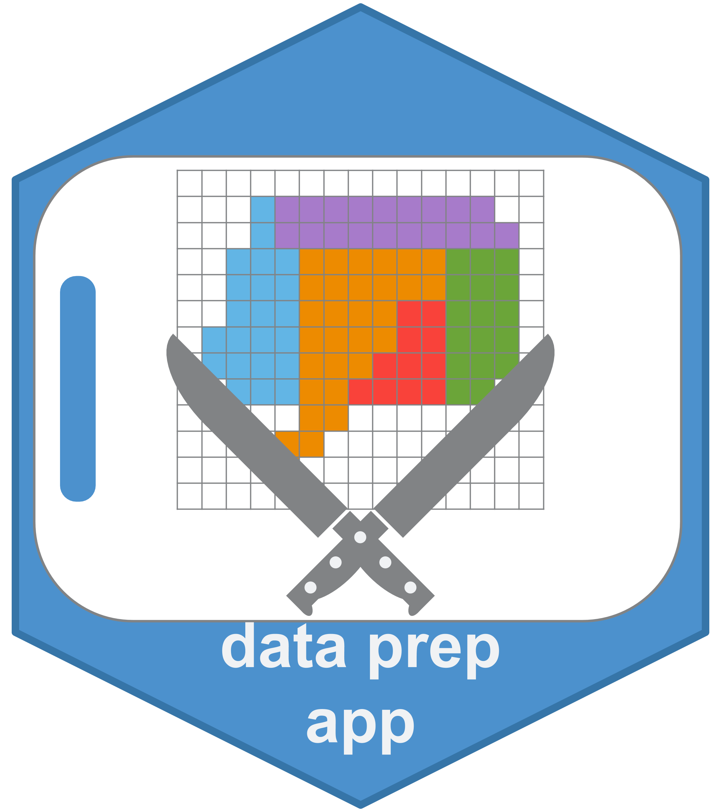
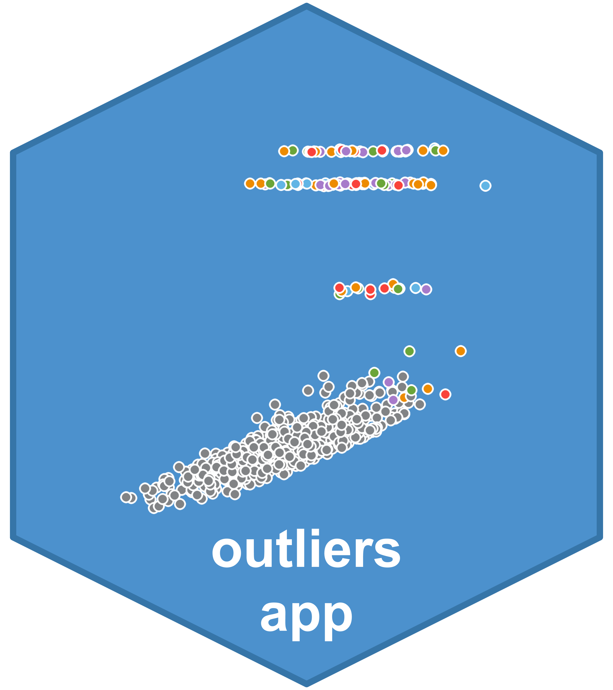

# 

The Ontario Neurodegenerative Disease Research Initiative (ONDRI) is a
series of studies of neurodegenerative and cerebrovascular diseases. For
an overview of the foundational prospective, observational, longitudinal
study at baseline see [this
preprint](https://www.medrxiv.org/content/10.1101/2020.07.30.20165456v1.full).
For more general information on the project, visit
[ondri.ca](https://ondri.ca/), and follow the study on Twitter:
[@ONDRISTUDY](https://twitter.com/ONDRISTUDY/).

  

# ondri-nibs 

The `ondri-nibs` page is a github organization page for the Ontario
Neurodegenerative Disease Research Initiative’s (ONDRI) Neuroinformatics
& Biostatistics (NIBS) team to house materials for public (and internal)
consumption.

Generally, this organization page has multiple repositories, each
repository contains a unique item (e.g., Shiny apps, packages) or
conceptual content (e.g., documentation). This page will provide links
to each of those as the project grows and changes.

To note, all materials here are licensed as follows unless otherwise
stated:

-   GPL-3 for software

-   CC-BY for documentation

If you use or adapt any materials here, please ensure you correctly do
so according to their licenses and with full attribution.

# contributors 

This [repository](https://github.com/ondri-nibs/contributors) is a
single file to keep track of all contributors to the NIBS material
provided here.

  

# ondridocs 

This [repository](https://github.com/ondri-nibs/documentation) is a home
for all the external facing (and some internally useful) documentation.

  

# toy data 

This [repository](https://github.com/ondri-nibs/toy_data) provides two
“toy” data sets. These data sets help illustrate a few things:

-   Each one shows how a tabular and non-tabular data set would be
    constructed

-   The data are synthetic, and also provide an illustrative data set
    for use with all of the apps and methods here (e.g., standards, data
    preparation, outlier detection)

# ondricolors 

This [repository](https://github.com/ondri-nibs/ondricolors) houses a
lightweight `R` package designed with one purpose: to provide a color
palette package with the official ONDRI colors.

  

# ondridown 

This [repository](https://github.com/ondri-nibs/ondridown) houses a
lightweight package to provide an `RMarkdown` template so that we can
have harmonized looking documents.

  

# Standards (Shiny) App 

This [repository](https://github.com/ondri-nibs/standards_app) houses a
heavy-duty app to check data standards for ONDRI and related projects,
as well as custom projects and basic data checks.

  

# Data preparation (Shiny) App 

This [repository](https://github.com/ondri-nibs/dataprep_app) houses an
app meant primarily for some fundamental but rudimentary data inspection
and preparation. This app is meant for use with ONDRI data and, in
particular, as the step between the standards checks and the outlier
analyses (though this app can be used for inspection and preparation for
other analyses).

  

# Outlier analyses (Shiny) App 

This [repository](https://github.com/ondri-nibs/outliers_app) houses an
app meant primarily for implementation of the ONDRI outliers detection
pipeline. In short, it provides visualization and report generation
based on the techniques found in the [Outliers and Robust Structures
(OuRS)](https://github.com/derekbeaton/OuRS) package.

  

# External materials

Some of the packages and utilities here depend on materials found
elsewhere. In most cases these are utilities generally found (e.g.,
tidyverse). Some specific materials that are necessary for much of the
NIBS pipelines are found at [Derek’s github
page](https://github.com/derekbeaton/) and include:

-   The [Outliers and Robust Structures
    (OuRS)](https://github.com/derekbeaton/OuRS) package

-   The [Generalized singular value
    decomposition](https://github.com/derekbeaton/GSVD) package

-   The [Generalized partial least
    squares](https://github.com/derekbeaton/GPLS) package

# And more!

This organization page will also include apps and packages for other
tools as they are developed.
